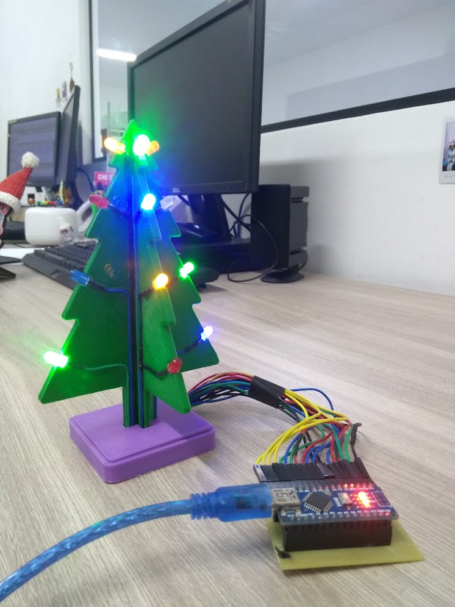

# Árvore de Natal - Impressora 3D + Arduino

Projeto de árvore de Natal para ser feito com impressora 3D e Arduino, contendo os arquivos STL, arquivos do SolidWorks, firmware e demais materiais do projeto.

## Vídeo

